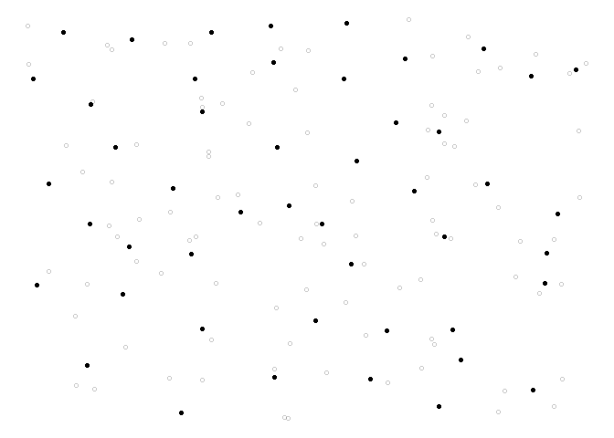

<!-- README.md is generated from README.Rmd. Please edit that file -->

# Weakly associated vectors (wave)

Spatial data are generally autocorrelated, meaning that if two units
selected are close to each other, then it is likely that they share the
same properties. For this reason, when sampling in the population it is
often needed that the sample is well spread over space. A new method to
draw a sample from a population with spatial coordinates is proposed.
This method is called `wave` (weakly associated vectors) sampling. It
uses the less correlated vector to a spatial weights matrix to update
the inclusion probabilities vector into a sample.

## Build

[](https://travis-ci.org/RJauslin/wave)

## Installation

You can install the released version of wave from GitHub

``` r
devtools::install_github("Rjauslin/wave")
```

## Simple example

This is a basic example which shows you how to solve a common problem.
Firtly we need to generate the spatial coordinates. We then create
randomly uniform coordinates from the function `runif()`,

``` r
library(wave)
#> Loading required package: Matrix

N <- 144
n <- 48
X <- cbind(runif(N),runif(N))
head(X,10)
#>            [,1]       [,2]
#>  [1,] 0.9827716 0.02720247
#>  [2,] 0.9099612 0.35267267
#>  [3,] 0.7984794 0.88668410
#>  [4,] 0.5981094 0.97463048
#>  [5,] 0.4927665 0.14498118
#>  [6,] 0.6816093 0.54230465
#>  [7,] 0.9375286 0.60360192
#>  [8,] 0.5571925 0.16860458
#>  [9,] 0.3223545 0.18762365
#> [10,] 0.4211185 0.17919766
```

Now we need the inclusion probabilities `pik`. Hence, we generate a
vector `pik` that have all the same values with the function `rep()`.

``` r
pik <- rep(n/N,times = N)
```

All that is left, is to use the function `wave()`.

``` r
s <- wave(X,pik)
```

We can also generate a plot to see

``` r
library(ggplot2)
ggplot() +
  geom_point(data = data.frame(x = X[,1],y = X[,2]),
             aes(x = x,y = y),
             shape = 1,
             alpha = 0.2)+
  geom_point(data = data.frame(x = X[s == 1,1],y = X[s == 1,2]),
             aes(x,y),
             shape = 16,
             colour = "black")+
  theme_minimal()+
  theme(panel.grid.major = element_blank(),
        panel.grid.minor = element_blank())
```


