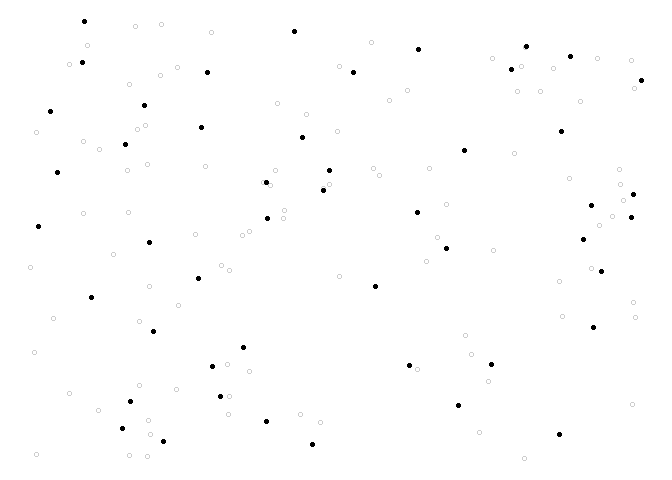

<!-- README.md is generated from README.Rmd. Please edit that file -->

# Weakly associated vectors (wave)

Spatial data are generally autocorrelated, meaning that if two units
selected are close to each other, then it is likely that they share the
same properties. For this reason, when sampling in the population it is
often needed that the sample is well spread over space. A new method to
draw a sample from a population with spatial coordinates is proposed.
This method is called `wave` (weakly associated vectors) sampling. It
uses the less correlated vector to a spatial weights matrix to update
the inclusion probabilities vector into a sample.

## Build

[](https://travis-ci.org/RJauslin/WaveSampling)

## Installation

You can install the released version of the package `WaveSampling` with
the following command

``` r
# install.packages("devtools")
devtools::install_github("Rjauslin/wave")
```

## Simple example

This basic example shows you how to solve a common problem. Spatial
coordinates from the function `runif()` are firstly generated.

``` r
library(WaveSampling)
#> Loading required package: Matrix

N <- 144
n <- 48
X <- cbind(runif(N),runif(N))
head(X,10)
#>            [,1]      [,2]
#>  [1,] 0.2503145 0.6480821
#>  [2,] 0.4659563 0.2868607
#>  [3,] 0.9293915 0.8133867
#>  [4,] 0.1181740 0.7124470
#>  [5,] 0.8252425 0.7764997
#>  [6,] 0.2079689 0.6986690
#>  [7,] 0.4173001 0.6464371
#>  [8,] 0.8537126 0.9499629
#>  [9,] 0.3984643 0.1910058
#> [10,] 0.3169390 0.9203666
```

Inclusion probabilities `pik` is set up all equal with the function
`rep()`.

``` r
pik <- rep(n/N,times = N)
```

It only remains to use the function `wave()`,

``` r
s <- wave(X,pik)
```

We can also generate a plot to see

``` r
library(ggplot2)
ggplot() +
  geom_point(data = data.frame(x = X[,1],y = X[,2]),
             aes(x = x,y = y),
             shape = 1,
             alpha = 0.2)+
  geom_point(data = data.frame(x = X[s == 1,1],y = X[s == 1,2]),
             aes(x,y),
             shape = 16,
             colour = "black")+
  theme_void()
```



## Performance

As explained on the website of Microsoft R open
<https://mran.microsoft.com/open>, R is designed to use only one thread
but could be linked with a multi-threaded version of BLAS/LAPACK. The
package is implemented with the package RcppArmadillo that provide an
integration of various matrix decompositions with LAPACK library. Intel
MKL that is used by the Microsoft R open use a multi-threaded version of
BLAS/LAPACK. Hence the package could gain time from the Microsoft R
open. (Not tested but linking R with OpenBLAS should also work).
